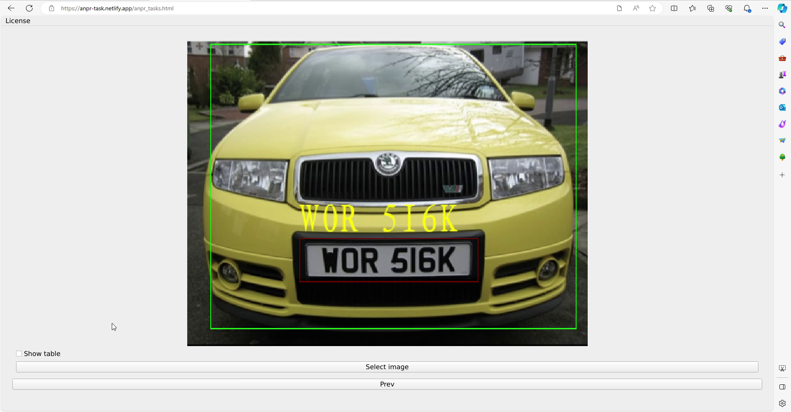
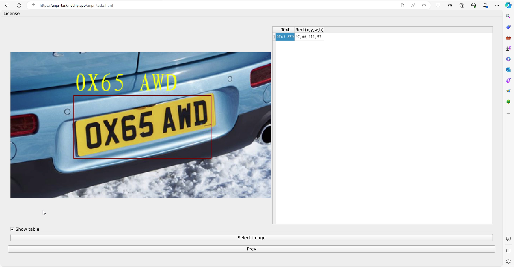
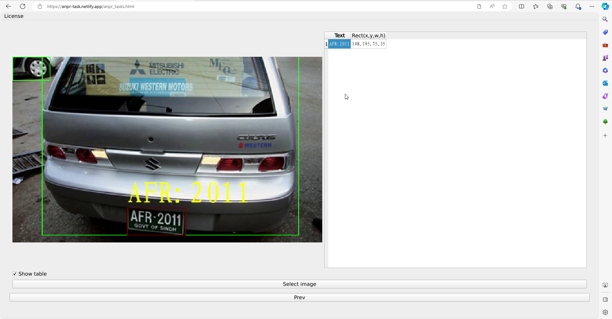

[English](./readme.md) | 简体中文

# 如何安装

- 网页版不需要安装，使用firefox/chrome开启[这个网址](https://anpr-task.netlify.app/anpr_tasks.html)即可使用
- 由于是使用webassembly开发的，第一次开启需要花点时间编译，请耐心等待
- 本程序的UI是针对桌面设计的，请在桌面上开启

# 简介

- 使用的ocr模型为 [paddle ocr v4](https://github.com/PaddlePaddle/PaddleOCR)
- 使用的载具和车牌检测模型是我收集资料后训练的（7433个训练样本，743个测试样本），采用的架构是nanodet plus

# 使用的第三方软件

- [opencv 4.8.0](https://github.com/opencv/opencv)
- [Qt6.5.2](https://www.qt.io/)
- [Boost 1.81.0](https://www.boost.org/)

# 网页版的限制

- 运行速度不如桌面版快
- Qt for webassembly虽然很好用，但他只有GPL和商用的license

# 范例

- [影片教学](https://www.youtube.com/watch?v=Eyp1smxac1k)
- 
- 
- 

# 将来的打算

- 利用yolov8训练一个更准确的车牌检测模型
- 支持视频，需要完成的功能包括但不限于车辆/车牌的追踪，选择适合的抽样率，保存最好的ocr结果
- 每一个地区的车牌都有其特征，可以针对不同地区的车牌特征，让anpr得到更好的结果
- 其他

# 其他

- 如果使用后觉得不错，请给我一颗星星，谢谢
- 如果发现bug，请开个issue
- 如果需要新的功能，请开个issue
- 该软件的开发者仅将其作为演示创建，不打算用于商业目的。
- 除直接售卖之外，本软件可用于个人或商业用途
- 使用本软件时，请遵守相关法律法规。软件开发者对因使用本软件而产生的任何损失不承担任何责任
- 如何编译支援simd和thread的Qt6.5.2，请参考[build_qt6_wasm_steps.txt](https://github.com/stereomatchingkiss/object_detection_and_alarm/blob/main/build_qt6_wasm_steps.txt)
- 释放桌面版
- GPU的支援会由vulkan完成，暂不打算支援cuda，因为这东西太肥大且只支援nvidia的gpu

# 联系我

- 如果你有案子要请我帮忙，请留下你的email
- 擅长利用现有的技术解决问题，倾向于使用Qt，opencv，ncnn，pytorch等现成的软体开发软件
- 擅长开发跨平台（windows, ubuntu, android, browser）的程式，plug in(windows, ubuntu, android, ios, browser)
- 擅长实现电脑视觉的算法，opencv contrib的image hash就是我开发的，除此之外也实现过一些paper上的算法
- 了解如何训练新的深度学习模型以满足客户的客制化需求