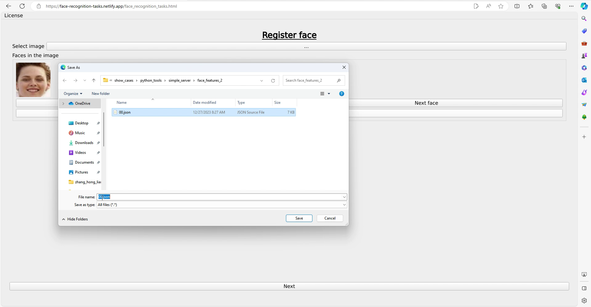
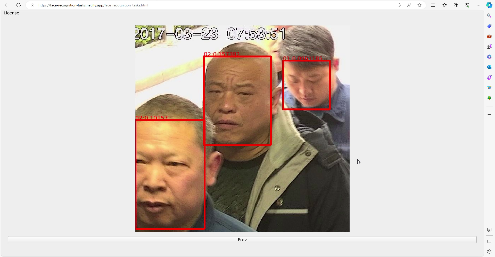
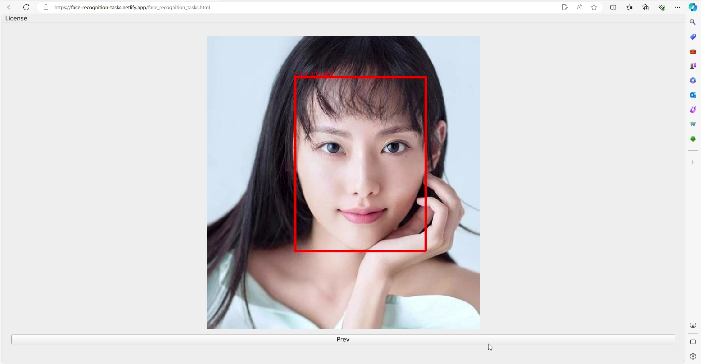

English | [简体中文](./readme_cn.md)

# How to install

- No installation required for web version. Open [this link](https://face-recognition-tasks.netlify.app/face_recognition_tasks.html) in Firefox/Chrome/Edges.
- As it is developed using WebAssembly, it takes a while to compile the first time you open it. Please wait patiently.

# Introduction

- Human identification application based on deep learning
- Provide simple and easy-to-use face recognition tools to meet daily needs

# Third-party software used

- [opencv 4.8.0](https://github.com/opencv/opencv)
- [ncnn-20230816](https://github.com/Tencent/ncnn)
- [Qt6.5.2](https://www.qt.io/)
- [Boost 1.81.0](https://www.boost.org/)

# Features of this software

- Register the faces you want to search for
- Search registered faces from images

# How to use the websocket of this software

- How to send pictures through websocket, please refer to [qt_base_face_search_server.py](https://github.com/stereomatchingkiss/show_cases/blob/master/python_tools/simple_server/qt_base_face_search_server.py)
- [readme.md](https://github.com/stereomatchingkiss/show_cases/blob/master/python_tools/simple_server/readme.md)，explain how to install the required packages

# Limitations of the web version

- The running speed is not as fast as the desktop version
- Unable to actively write settings and alarms to local hard drive. In order to bypass this limitation, the web version provides websocket to transmit alarms.
- Deep learning algorithms do not support GPU
- When using websocket to transmit information, if it is not a local machine, SSL must be used, and the key used by the target must be recognized by the browser.
- Neither OpenCV nor Qt's multimedia module provides good support for browsers, so the web version only supports image transmission using websockets.
- Qt for WebAssembly is a very useful tool, but it is only available under the GPL and commercial licenses.

# Examples

- [Face recognition tutorial](https://www.youtube.com/watch?v=PICwMVUFLPw)
- 
- 
- 

# Future plans

- Supports alerts based on facial recognition
- others

# Usage occasions

- Security monitoring, photo organization

# Others

- If you think it is good after using it, please give me a star, thank you
- If you find a bug, please open an issue
- If you need new features, please open an issue
- GPU support will be completed by Vulkan. We don't plan to support CUDA for now, because it's too bloated and only supports Nvidia GPUs.
- The developer of this software created it as a demo and does not intend to use it for commercial purposes.
- Except for direct sales, this software can be used for personal or commercial purposes.
- When using this software, please comply with relevant laws and regulations. The software developer is not responsible for any losses caused by using this software.
- How to compile Qt6.5.2 that supports SIMD and thread, please refer to [build_qt6_wasm_steps.txt](https://github.com/stereomatchingkiss/object_detection_and_alarm/blob/main/build_qt6_wasm_steps.txt)
- The UI of this program is designed for desktop, please open it on the desktop
- Release the desktop version

# Contact me

- If you have a case to ask me for help, please leave your email
- Good at solving problems using existing technologies, prefer to use Qt