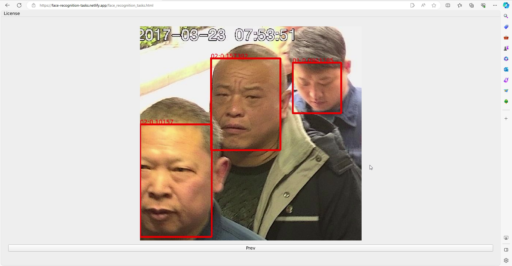

[English](./readme.md) | 简体中文

# 如何安装

- 网页版不需要安装，使用firefox/chrome开启[这个网址](https://face-recognition-tasks.netlify.app/face_recognition_tasks.html)即可使用
- 由于是使用webassembly开发的，第一次开启需要花点时间编译，请耐心等待
- 本程序的UI是针对桌面设计的，请在桌面上开启

# 简介

- 基于深度学习的人类辨识应用
- 提供简单好用的人脸辨识工具，满足日常需求

# 使用的第三方软件

- [opencv 4.8.0](https://github.com/opencv/opencv)
- [ncnn-20230816](https://github.com/Tencent/ncnn)
- [Qt6.5.2](https://www.qt.io/)
- [Boost 1.81.0](https://www.boost.org/)

# 本软体的功能

- 注册欲搜寻的人脸
- 从图像中搜寻已经注册的人脸

# 这软体的websocket如何使用

- 如何透过websocket传送图片，请参考 [qt_base_face_search_server.py](https://github.com/stereomatchingkiss/show_cases/blob/master/python_tools/simple_server/qt_base_face_search_server.py)
- [readme.md](https://github.com/stereomatchingkiss/show_cases/blob/master/python_tools/simple_server/readme.md)，解释如何安装需要的package

# 网页版的限制

- 运行速度不如桌面版快
- 无法主动将设定，警报写入本地硬碟，为了绕开这一限制，网页版提供了websocket传送警报
- 深度学习的算法不支援GPU
- 使用websocket传送信息的时候，如果不是本地机器，必须使用ssl，且目标所使用的key必须被浏览器承认
- 无论是opencv或Qt的多媒体模组，对浏览器的支援都不好，所以网页版只支持利用websocket传输影像的模式
- Qt for webassembly虽然很好用，但他只有GPL和商用的license

# 范例

- [人脸搜寻的影片教学](https://www.youtube.com/watch?v=PICwMVUFLPw)
- 
- 
- 

# 将来的打算

- 支持基于人脸辨识的警报
- 其他

# 使用场合

- 安防监控、相片整理

# 其他

- 如果使用后觉得不错，请给我一颗星星，谢谢
- 如果发现bug，请开个issue
- 如果需要新的功能，请开个issue
- 该软件的开发者仅将其作为演示创建，不打算用于商业目的。
- 除直接售卖之外，本软件可用于个人或商业用途
- 使用本软件时，请遵守相关法律法规。软件开发者对因使用本软件而产生的任何损失不承担任何责任
- 如何编译支援simd和thread的Qt6.5.2，请参考[build_qt6_wasm_steps.txt](https://github.com/stereomatchingkiss/object_detection_and_alarm/blob/main/build_qt6_wasm_steps.txt)
- 释放桌面版
- GPU的支援会由vulkan完成，暂不打算支援cuda，因为这东西太肥大且只支援nvidia的gpu

# 联系我

- 如果你有案子要请我帮忙，请留下你的email
- 擅长利用现有的技术解决问题，倾向于使用Qt，opencv，ncnn，pytorch等现成的软体开发软件
- 擅长开发跨平台（windows, ubuntu, android, browser）的程式，plug in(windows, ubuntu, android, ios, browser)
- 擅长实现电脑视觉的算法，opencv contrib的image hash就是我开发的，除此之外也实现过一些paper上的算法
- 了解如何训练新的深度学习模型以满足客户的客制化需求