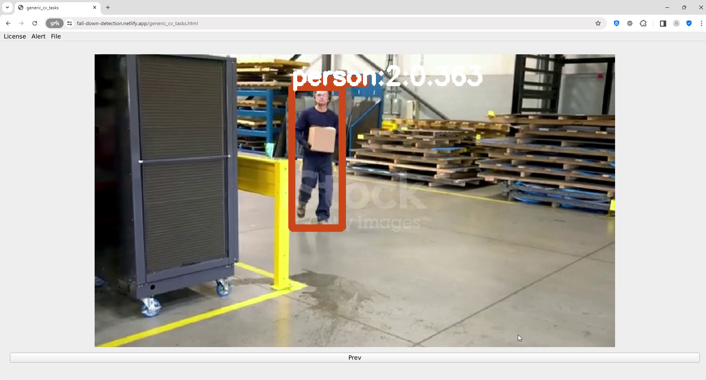
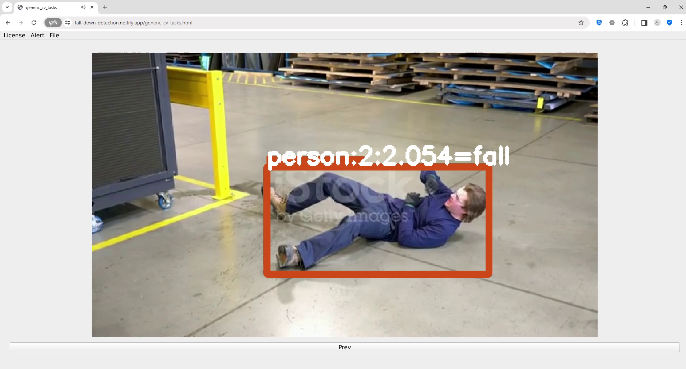

[English](./readme.md) | 简体中文

# 如何安装

- 网页版不需要安装，使用firefox/chrome开启[这个网址](https://fall-down-detection.netlify.app/generic_cv_tasks.html)即可使用
- 由于是使用webassembly开发的，第一次开启需要花点时间编译，请耐心等待
- 本程序的UI是针对桌面设计的，请在桌面上开启

# 简介

- 使用的模型为 [nanodet](https://github.com/RangiLyu/nanodet)和[yolov8](https://github.com/ultralytics/ultralytics)
- 提供简单好用的摔倒检测工具，满足日常需求

# 使用的第三方软件

- [opencv 4.8.0](https://github.com/opencv/opencv)
- [Qt6.5.2](https://www.qt.io/)
- [ncnn](https://github.com/Tencent/ncnn)
- [Boost 1.81.0](https://www.boost.org/)

# 这软体的websocket如何使用

- 请透过websocket传送影像，详情请参考 [qt_base_opencv_videocapture_server.py](https://github.com/stereomatchingkiss/show_cases/blob/master/python_tools/simple_server/qt_base_opencv_videocapture_server.py)
- 这软体支援将摔倒警报发送到电子信箱的功能。为了发送电子邮件，你首先得申请一个gmail信箱并做些设置，这部分的详情请参考这个[视频](https://www.youtube.com/watch?v=g_j6ILT-X0k&t=582s)。信箱的申请和设置完毕后，请利用[qt_base_fall_down_obj_det_alert_receiver.py](https://github.com/stereomatchingkiss/show_cases/blob/master/python_tools/simple_server/qt_base_fall_down_obj_det_alert_receiver.py)接收和发送警报

# 网页版的限制

- 运行速度不如桌面版快
- 无法主动将设定，警报写入本地硬碟，为了绕开这一限制，网页版提供了websocket传送警报
- 使用websocket传送信息的时候，如果不是本地机器，必须使用ssl，且目标所使用的key必须被浏览器承认
- Qt for webassembly虽然很好用，但他只有GPL和商用的license

# 范例

- [影片教学](https://www.youtube.com/watch?v=gI_S8KvLkkM)
- 
- 
- 

# 将来的打算

- 支持同时监控多个视频
- 支持不同的物件检测模型
- 用其他演算法检测摔倒
- 其他

# 原始码

- 位于[generic_cv_tasks](../generic_cv_tasks)，由于有大量代码是重复的，我选择把这项功能整合进generic_cv_tasks中并透过CMake控制那些功能应该编译

# 其他

- 如果使用后觉得不错，请给我一颗星星，谢谢
- 如果发现bug，请开个issue
- 如果需要新的功能，请开个issue
- 该软件的开发者仅将其作为演示创建，不打算用于商业目的。
- 除直接售卖之外，本软件可用于个人或商业用途
- 使用本软件时，请遵守相关法律法规。软件开发者对因使用本软件而产生的任何损失不承担任何责任
- 如何编译支援simd和thread的Qt6.5.2，请参考[build_qt6_wasm_steps.txt](https://github.com/stereomatchingkiss/object_detection_and_alarm/blob/main/build_qt6_wasm_steps.txt)
- 释放桌面版
- GPU的支援会由vulkan完成，暂不打算支援cuda，因为这东西太肥大且只支援nvidia的gpu

# 联系我

- 如果你有案子要请我帮忙，请留下你的email
- 擅长利用现有的技术解决问题，倾向于使用Qt，opencv，ncnn，pytorch等现成的软体开发软件
- 擅长开发跨平台（windows, ubuntu, android, browser）的程式，plug in(windows, ubuntu, android, ios, browser)
- 擅长实现电脑视觉的算法，opencv contrib的image hash就是我开发的，除此之外也实现过一些paper上的算法
- 了解如何训练新的深度学习模型以满足客户的客制化需求