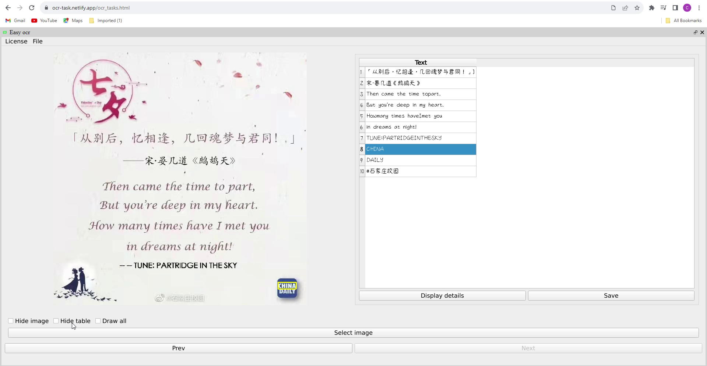
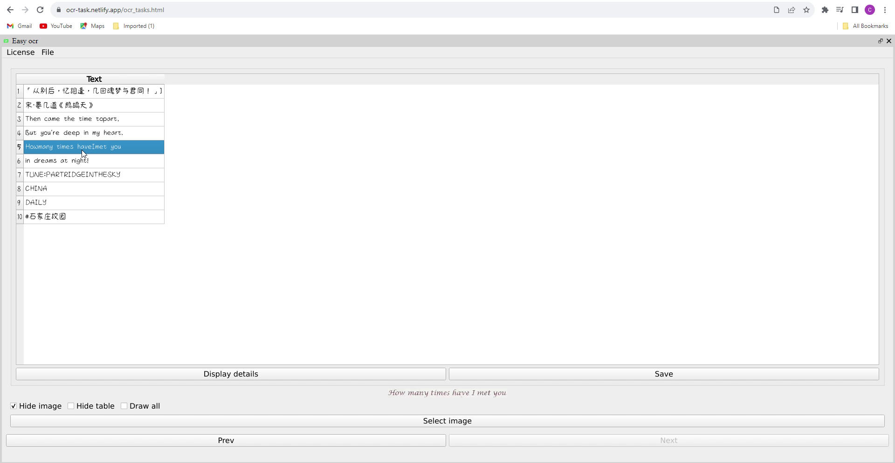
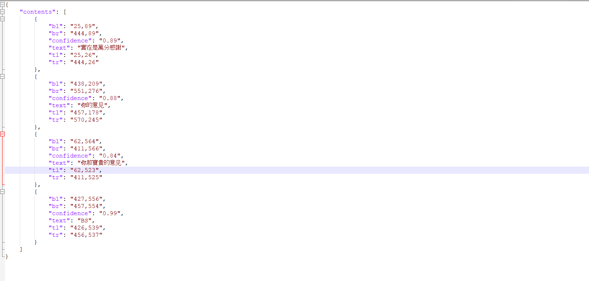

English | [简体中文](./readme_cn.md)

# How to install

- The web version does not need to be installed. Open this [website](https://ocr-task.netlify.app/ocr_tasks.html) with Firefox/Chrome/edge to use.
- Since it is developed using WebAssembly, it will take some time to compile the first time you open it. Please be patient.
- The UI of this program is designed for desktop, please open it on the desktop.

# Introduction

- This OCR web page supports simplified Chinese, traditional Chinese, and English.
- The model used is [paddle ocr v4](https://github.com/PaddlePaddle/PaddleOCR)
- Provides simple and easy-to-use object detection tools to meet daily needs.

# Third-party software used

- [opencv 4.8.0](https://github.com/opencv/opencv)
- [Qt6.5.2](https://www.qt.io/)
- [onnxruntime](https://onnxruntime.ai/docs/build/web.html)
- [Boost 1.81.0](https://www.boost.org/)

# How to use the websocket of this software

- If you want to batch process images, please send them through websocket. For details, please refer to [qt_base_ocr_server.py](https://github.com/stereomatchingkiss/show_cases/blob/master/python_tools/simple_server/qt_base_ocr_server.py)

# Limitations of the web version

- The running speed is not as fast as the desktop version.
- Cannot actively write settings or alerts to the local hard drive. To bypass this limitation, the web version provides websocket to send alerts.
- When sending information through websocket, if it is not a local machine, you must use SSL, and the key used by the target must be recognized by the browser.
- Qt for WebAssembly is very good, but it only has GPL and commercial licenses.

# Examples

- [Video tutorial](https://youtu.be/30p-nRqsVss)
- 
- 
- 
- 

# Future plans

- Support more languages
- Other

# Others

- If you think it is good after using it, please give me a star, thank you
- If you find a bug, please open an issue
- If you need new features, please open an issue
- GPU support will be completed by Vulkan. We don't plan to support CUDA for now, because it's too bloated and only supports Nvidia GPUs.
- The developer of this software created it as a demo and does not intend to use it for commercial purposes.
- Except for direct sales, this software can be used for personal or commercial purposes.
- When using this software, please comply with relevant laws and regulations. The software developer is not responsible for any losses caused by using this software.
- How to compile Qt6.5.2 that supports SIMD and thread, please refer to [build_qt6_wasm_steps.txt](https://github.com/stereomatchingkiss/object_detection_and_alarm/blob/main/build_qt6_wasm_steps.txt)
- The UI of this program is designed for desktop, please open it on the desktop
- Release the desktop version

# Contact me

- If you have a case to ask me for help, please leave your email
- Good at solving problems using existing technologies, prefer to use Qt